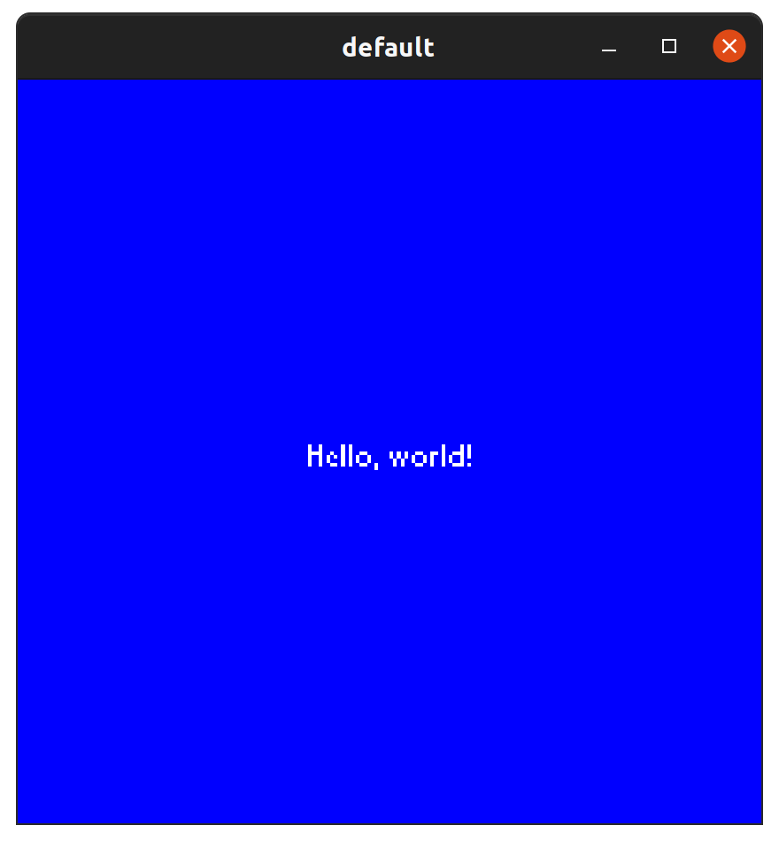

# Screen 13 Example Code

## Getting Started

A helpful [getting started](getting-started.md) guide is available which describes basic _Screen 13_
types and functions.

## `basic.rs`

```bash
cargo run --release examples/res/basic.toml
cargo run --release --example basic
```


